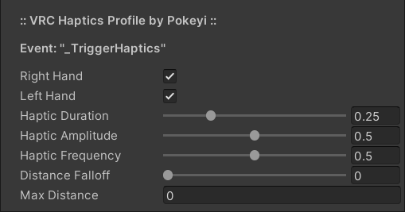

# VRC-Haptics-Profile 
Controller haptics profile for VRChat.

## Overview
VRC Haptics Profile is a single configurable UdonSharp behaviour that can be used to custom-tailor controller vibration presets to be placed in your scene with additional options for distance-based culling and amplitude-falloff.

It is intended to be efficient and relatively simple to use without the need for any additional editor scripts or dependencies outside of UdonSharp. All configuration can be done within the Unity Inspector window without the need for any programming, Udon, or SDK knowledge. That said, the source code is cleanly-organized and commented in the hopes of also being a good learning tool.

### Requirements
Errors regarding functions not being exposed likely mean you need an updated version of the SDK or UdonSharp.
- [VRChat Worlds SDK3](https://vrchat.com/home/download) (Tested: v2021.11.8)
- [UdonSharp](https://github.com/MerlinVR/UdonSharp) (Tested: v0.20.3)

### Optional
Components with specific functionality supporting this behaviour, should you like to use them.
- [VRC Omni-Action](https://github.com/Pokeyi/VRC-Omni-Action) (Multi-Purpose Function Handler)

### Recommended
Other useful VRChat world-creation tools that I will always recommend.
- [World Creator Assistant](https://github.com/Varneon/WorldCreatorAssistant) (SDK & Package Management)
- [CyanEmu](https://github.com/CyanLaser/CyanEmu) (Unity-Window Testing)

### Setup
Make sure you have already imported the VRChat Worlds SDK and UdonSharp into your project.
- Download the latest [Unity Package](https://github.com/Pokeyi/VRC-Haptics-Profile/releases) and import it into your project.
- A pre-configured example prefab is included that you can drop into your scene if you like.
- Create and select an empty game object and add the P_HapticsProfile behaviour via the Unity Inspector window or 'Component > Pokeyi.VRChat > P.VRC Haptics Profile' toolbar menu.
- Click the 'Convert to UdonBehaviour' button if prompted.
- Configure the behaviour's properties in the Inspector window as you see fit. Each of these is explained in detail further below.

## Features
The main features of the Haptics Profile.
- Hand Toggles - Which of the player's controllers the haptic event will effect.
- Haptic Properties - Duration, amplitude, and frequency of the haptic event.
- Distance Options - Additional modifiers for distance-based culling and amplitude-falloff.
- Trigger Event - Method for triggering the haptic event.

All of the following properties have hover-tooltips in the Unity Inspector window.

### Hand Toggles
Which of the player's controllers the haptic event will effect.
- Right Hand - Enable haptic event in the player's right hand.
- Left Hand - Enable haptic event in the player's left hand.

### Haptic Properties
Duration, amplitude, and frequency of the haptic event, each with a maximum value of 1.0.
- Haptic Duration - Overall length of the haptic event.
- Haptic Amplitude - Strength of the haptic event.
- Haptic Frequency - Wavelength / rapidity of the haptic event.

### Distance Options
Additional modifiers for distance-based culling and amplitude-falloff.
- Distance Falloff - How fast the amplitude / strength of the haptic event will fade in relation to distance from the player.
- Max Distance - Maximum distance from the player within which the haptic event can still be received.

### Trigger Event
Call the public "\_TriggerHaptics" method to trigger the haptic event for the local player. (See: Notes [#1](#notes))
- This can be done without any programming by selecting 'SendCustomEvent(String)' from the dropdown for [UI Events](https://docs.vrchat.com/docs/ui-events).
- You can also reference the Haptics Profile in another Udon Behaviour and call the custom event or public method from there.
- The [VRC Omni-Action](https://github.com/Pokeyi/VRC-Omni-Action) component has built-in functionality for Haptics Profiles as well as a Timer Repeat enabling the potential for creation of loops to bypass haptic duration limits and create more dynamic haptic events.

### Use Case Examples
The maximum possible value for any of the Haptic Properties is 1.0.
- A Duration of 0.25, Amplitude of 0.5, and Frequency of 0.5 with no Falloff are default and fitting for small events like UI-button clicks.

### Notes
1. Per the VRChat API, public method/event names starting with an "\_Underscore" are protected from remote network calls, necessitating use of a local-only event. Doing this protects them from being called by malicious clients and potentially breaking functionality in your world.

## Credit & Support
Please credit me as Pokeyi if you use my work. I would also love to see your creations that make use of it if you're inclined to share. This and [related projects](https://github.com/Pokeyi/pokeyi.github.io#my-projects) at release have involved over three months of solid work and self-education as I strive for an opportunity to change careers and make a better life for myself. If you find value in my work, please consider supporting me, I appreciate it more than you can imagine!

## License
This work is licensed under the MIT License.

Copyright © 2021 Pokeyi - https://pokeyi.dev - [pokeyi@pm.me](mailto:pokeyi@pm.me)

Permission is hereby granted, free of charge, to any person obtaining a copy
of this software and associated documentation files (the "Software"), to deal
in the Software without restriction, including without limitation the rights
to use, copy, modify, merge, publish, distribute, sublicense, and/or sell
copies of the Software, and to permit persons to whom the Software is
furnished to do so, subject to the following conditions:

The above copyright notice and this permission notice shall be included in all
copies or substantial portions of the Software.

THE SOFTWARE IS PROVIDED "AS IS", WITHOUT WARRANTY OF ANY KIND, EXPRESS OR
IMPLIED, INCLUDING BUT NOT LIMITED TO THE WARRANTIES OF MERCHANTABILITY,
FITNESS FOR A PARTICULAR PURPOSE AND NONINFRINGEMENT. IN NO EVENT SHALL THE
AUTHORS OR COPYRIGHT HOLDERS BE LIABLE FOR ANY CLAIM, DAMAGES OR OTHER
LIABILITY, WHETHER IN AN ACTION OF CONTRACT, TORT OR OTHERWISE, ARISING FROM,
OUT OF OR IN CONNECTION WITH THE SOFTWARE OR THE USE OR OTHER DEALINGS IN THE
SOFTWARE.
